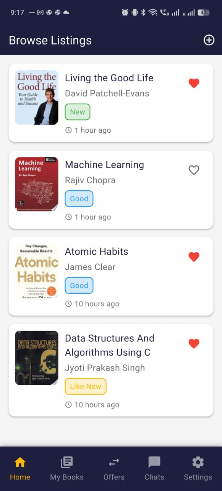
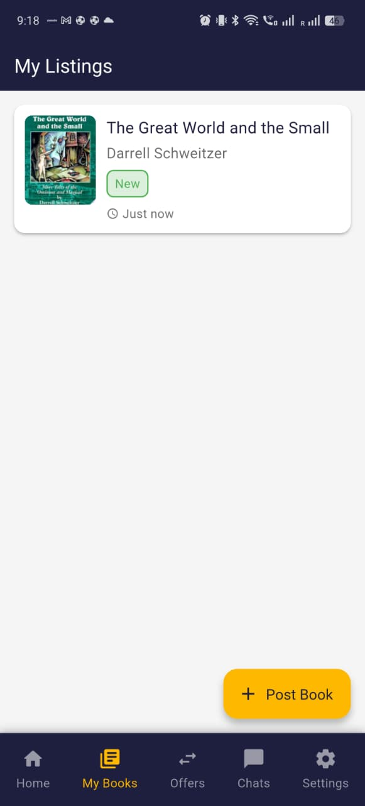
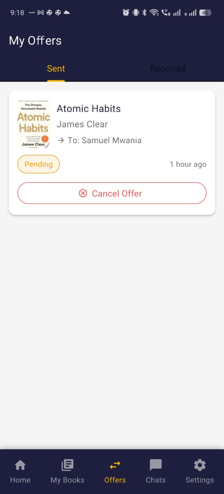
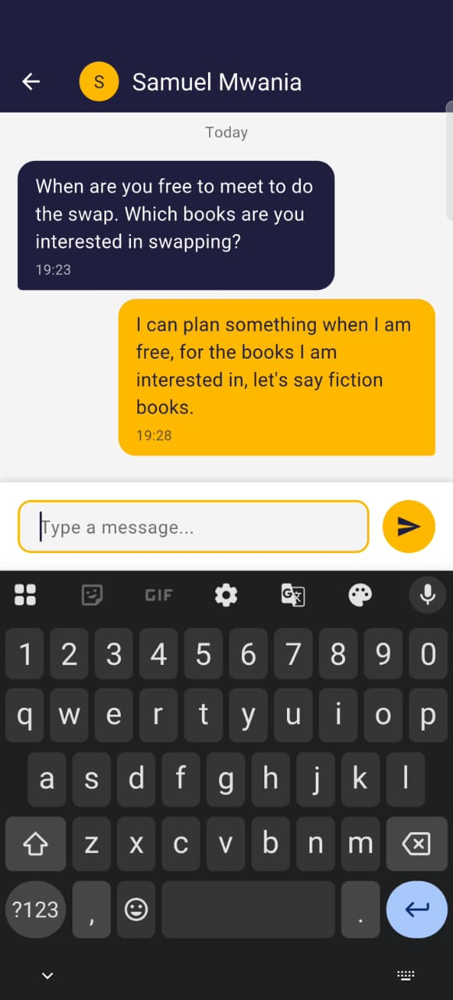
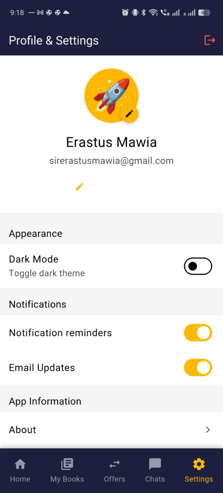

# 📚 BookSwap - Flutter Book Exchange App

A full-featured Flutter mobile application for exchanging books between users, built with Firebase backend and real-time synchronization.

## Project Overview

BookSwap is a social book exchange platform that allows users to:
- Browse available books from other users
- Post their own books for swapping
- Send and receive swap offers
- Chat in real-time with other users
- Manage their book listings and offers

## ✨ Features

### Authentication
- **Email/Password Authentication** with Firebase Auth
- **Email Verification** with automatic refresh detection
- **Google Sign-In** integration
- Secure session management

### Book Management (CRUD Operations)
- **Create**: Post books with images, condition, and swap preferences
- **Read**: Browse all available books with real-time updates
- **Update**: Edit book details and images
- **Delete**: Remove listings with swipe-to-delete gesture

### Swap System
- Send swap offers to book owners
- Accept/Reject/Cancel offers with real-time status updates
- Separate tabs for Sent and Received offers
- Badge notifications for pending offers
- Automatic chat room creation on swap acceptance

### Real-Time Chat
- Firebase Firestore real-time messaging
- Instant message synchronization
- Message timestamps and read status
- Chat initiated from book details or accepted swaps
- NO mock data - fully integrated with Firebase

### UI/UX Features
- **Material Design 3** implementation
- **Dark Mode** support with smooth transitions
- **5-Screen Bottom Navigation**:
  - Home (Browse Books)
  - My Listings
  - My Offers (with badge indicators)
  - Chats
  - Profile & Settings
- Book condition badges (New, Like New, Good, Used)
- Like/Favorite books with heart icon
- Pull-to-refresh on all list screens
- Responsive cards and modals

### Media Handling
- Firebase Storage integration
- Image upload with compression
- Cached network images for performance
- Default placeholder for books without images

## 📱 Screenshots

### Home Screen - Browse Books


Browse all available books with:
- Book covers, titles, authors
- Condition badges
- Like/favorite functionality
- Time posted indicators
- Tap to view details and initiate swap

### My Listings


Manage your posted books:
- View all your listings
- Swipe to delete with confirmation
- Tap to edit or view details
- Floating action button to post new books

### My Offers - Received Tab


Received swap offers with:
- Book details and requester info
- Accept/Reject buttons
- Real-time status updates
- Empty state messaging

### My Offers - Sent Tab


Track your sent offers:
- Pending/Accepted/Rejected status badges
- Cancel offer option
- Target user information
- Time since offer sent

### Real-Time Chat


Firebase-powered messaging:
- Real-time message synchronization
- Message bubbles with timestamps
- Send button with input validation
- Auto-scroll to latest messages
- Participant avatar display

### Profile & Settings


User profile management:
- Avatar customization
- Dark mode toggle
- Notification preferences
- Email updates settings
- Logout functionality

## � Tech Stack

### Frontend
- **Flutter 3.35.3** - Cross-platform mobile framework
- **Dart 3.9.2** - Programming language
- **Material Design 3** - Design system
- **Provider 6.1.2** - State management

### Backend & Services
- **Firebase Authentication** - User authentication
- **Cloud Firestore** - Real-time NoSQL database
- **Firebase Storage** - Image/file storage
- **Security Rules** - Firestore and Storage security

### Key Packages
```yaml
dependencies:
  flutter:
    sdk: flutter
  
  # Firebase
  firebase_core: ^3.6.0
  firebase_auth: ^5.3.1
  cloud_firestore: ^5.4.4
  firebase_storage: ^12.3.4
  
  # State Management
  provider: ^6.1.2
  
  # UI & Media
  cached_network_image: ^3.4.1
  image_picker: ^1.1.2
  
  # Google Sign-In
  google_sign_in: ^6.2.2
```

## Project Structure

```
lib/
├── main.dart                          # App entry point
├── core.dart                          # Core exports
├── firebase_options.dart              # Firebase configuration
│
├── config/
│   ├── app_theme.dart                # Theme configuration & colors
│   └── routes.dart                   # Navigation routes
│
├── models/
│   ├── user_model.dart               # User data model
│   ├── book.dart                     # Book data model with conditions
│   ├── swap_offer.dart               # Swap offer model with status
│   └── chat.dart                     # Chat & message models
│
├── providers/
│   ├── auth_provider.dart            # Authentication state
│   ├── theme_provider.dart           # Dark mode state
│   ├── book_provider.dart            # Books state
│   └── swap_provider.dart            # Swaps state with real-time
│
├── services/
│   ├── auth_service.dart             # Firebase Auth operations
│   └── firestore_service.dart        # Firestore CRUD & streams
│
├── screens/
│   ├── auth/
│   │   ├── auth_wrapper.dart         # Auth state router
│   │   ├── login_screen.dart         # Login UI
│   │   ├── signup_screen.dart        # Signup UI
│   │   └── email_verification_screen.dart  # Email verify with auto-refresh
│   │
│   ├── home_screen.dart              # Browse books
│   ├── my_listings_screen.dart       # User's books
│   ├── my_offers_screen.dart         # Sent/Received swaps
│   ├── chats_screen.dart             # Chat list
│   ├── chat_detail_screen.dart       # Real-time messaging
│   ├── profile_screen.dart           # User profile & settings
│   ├── post_book_screen.dart         # Create book listing
│   └── edit_book_screen.dart         # Update book listing
│
└── widgets/
    └── book_card.dart                # Reusable book card component
```

## Firebase Configuration

### Firestore Collections

#### `users`
```json
{
  "uid": "string",
  "email": "string",
  "name": "string",
  "createdAt": "timestamp"
}
```

#### `books`
```json
{
  "id": "string",
  "title": "string",
  "author": "string",
  "ownerId": "string",
  "ownerName": "string",
  "condition": "brandNew | likeNew | good | used",
  "swapFor": "string?",
  "description": "string?",
  "imageUrl": "string?",
  "likedBy": "array<string>",
  "createdAt": "timestamp",
  "postedAt": "timestamp"
}
```

#### `swaps`
```json
{
  "id": "string",
  "senderId": "string",
  "senderName": "string",
  "receiverId": "string",
  "receiverName": "string",
  "bookId": "string",
  "bookTitle": "string",
  "offeredBookTitle": "string",
  "message": "string",
  "status": "pending | accepted | rejected | cancelled",
  "createdAt": "timestamp",
  "updatedAt": "timestamp"
}
```

#### `chatRooms`
```json
{
  "id": "string",
  "participants": "array<string>",
  "bookId": "string",
  "swapId": "string?",
  "lastMessage": "string",
  "lastMessageTime": "timestamp",
  "createdAt": "timestamp"
}
```

#### `chatRooms/{id}/messages`
```json
{
  "id": "string",
  "senderId": "string",
  "content": "string",
  "timestamp": "timestamp",
  "isRead": "boolean"
}
```

### Security Rules

**Firestore Rules** (`firestore.rules`):
- Users can only write their own profile
- Anyone authenticated can read books
- Book owners can update/delete their listings
- Anyone can update `likedBy` field only
- Swap participants can read/update swaps
- Chat participants can read/write messages
- Security rules enforce participant-based access

**Storage Rules** (`storage.rules`):
- Only authenticated users can upload
- File size limited to 5MB
- Only image file types allowed

## Getting Started

### Prerequisites
- Flutter SDK 3.35.3 or higher
- Dart SDK 3.9.2 or higher
- Android Studio / VS Code
- Firebase account

### Installation

1. **Clone the repository**
```bash
git clone https://github.com/mwaniasam/flutter-assigmnent-2.git
cd bookswap_app
```

2. **Install dependencies**
```bash
flutter pub get
```

3. **Configure Firebase**
   - Create a new Firebase project at [Firebase Console](https://console.firebase.google.com)
   - Add Android app with package name: `com.example.bookswap_app`
   - Download `google-services.json` to `android/app/`
   - Enable Authentication (Email/Password & Google)
   - Create Firestore Database
   - Create Storage bucket
   - Deploy security rules from `firestore.rules` and `storage.rules`

4. **Run the app**
```bash
# Check connected devices
flutter devices

# Run on connected device
flutter run

# For wireless Android debugging
adb connect <IP>:<PORT>
flutter run -d <IP>:<PORT>
```

### Build APK
```bash
flutter build apk --release
```

## Features Checklist

### Authentication
- [x] Email/Password signup
- [x] Email verification with auto-refresh
- [x] Login with credentials
- [x] Google Sign-In
- [x] Logout functionality
- [x] Session persistence

### Book Management
- [x] Post book with image upload
- [x] Browse all books (real-time)
- [x] View book details
- [x] Edit book details
- [x] Delete book (swipe gesture)
- [x] Like/favorite books
- [x] Book condition badges

### Swap System
- [x] Send swap offer
- [x] View received offers
- [x] View sent offers
- [x] Accept/reject offers
- [x] Cancel sent offers
- [x] Real-time status updates
- [x] Badge notifications
- [x] Auto-create chat on acceptance

### Chat System
- [x] Real-time messaging (Firebase)
- [x] Chat list with last message
- [x] Message timestamps
- [x] Read/unread status
- [x] Auto-scroll to latest
- [x] NO mock data

### UI/UX
- [x] Material Design 3
- [x] Dark mode support
- [x] 5-screen navigation
- [x] Pull-to-refresh
- [x] Empty states
- [x] Loading indicators
- [x] Error handling
- [x] Responsive design

## Project Requirements Met

✅ **CRUD Operations**: Complete Create, Read, Update, Delete for books  
✅ **Firebase Integration**: Auth, Firestore, Storage fully integrated  
✅ **Real-time Data**: Streams for books, swaps, and chat  
✅ **State Management**: Provider pattern with 4 providers  
✅ **Email Verification**: Auto-refresh mechanism implemented  
✅ **Image Upload**: Firebase Storage with compression  
✅ **Security Rules**: Comprehensive Firestore and Storage rules  
✅ **No Mock Data**: All data from Firebase  
✅ **Professional UI**: Material Design 3 with dark mode  
✅ **Error Handling**: Try-catch blocks and user feedback  

## Known Issues & Limitations

1. **Composite Indexes**: Some complex queries removed to avoid index requirements (e.g., unread message count)
2. **Dark Mode**: Minor TextStyle interpolation warning (non-blocking)
3. **Performance**: Large image uploads may take time on slow networks

## Future Enhancements

- [ ] Add book search and filters
- [ ] Implement user ratings/reviews
- [ ] Add push notifications
- [ ] Support multiple book images
- [ ] Add swap history tracking
- [ ] Implement book categories
- [ ] Add location-based filtering
- [ ] Support in-app notifications

## License

This project is created for educational purposes 

## Author

**Samuel Mwania**
- GitHub: [@mwaniasam](https://github.com/mwaniasam)
- Email: sirerastusmawia@gmail.com

## Acknowledgments

- Flutter & Firebase documentation
- Material Design 3 guidelines
- Provider package for state management
- GitHub Copilot for development assistance

---

Built with Flutter 3.35.3
